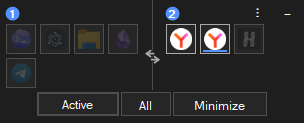

# Screen Switch

[English](README.md) | Русский

<p align="center">
  
</p>

Screen Switch — небольшое Windows-приложение в трее для переноса окон между двумя мониторами.

<p align="center">
  
</p>

## Возможности

- Перенос активного окна, всех окон или выбранных окон на другой монитор.
- Управление через меню в трее или настраиваемые глобальные горячие клавиши.
- Окно "Перенести окно" с режимами таблицы и плиток, иконками приложений, индикаторами мониторов, состоянием окна, множественным выбором и переносом по двойному клику.
- Компактный оверлей для быстрого переноса окон, drag-to-move между зонами мониторов и действий для активного окна, всех окон и сворачивания.
- Сворачивание всех видимых переносимых окон.
- Сохранение относительного положения и размера окна внутри рабочей области целевого монитора.
- Поддержка обычных, развёрнутых, свёрнутых и browser fullscreen окон.
- Переключение между светлой и тёмной темами.
- Настройки уведомлений, автозапуска вместе с Windows, положения оверлея, прозрачности оверлея и режима перетаскивания.

## Языки

Английский — язык интерфейса по умолчанию. Русский можно выбрать в меню приложения.

## Готовый EXE

Можно использовать готовый `ScreenSwitch.exe` из release-архива:

1. Скачайте последний релиз в [GitHub Releases](https://github.com/DieInTyo/screen-switch/releases).
2. Распакуйте zip в любое удобное место.
3. Запустите `ScreenSwitch.exe`.

После запуска приложение появится в трее Windows или в области скрытых значков.

## Сборка из исходников

Требования:

- Windows
- .NET SDK 8 или новее

Собрать release executable:

```powershell
dotnet publish .\ScreenSwitch.csproj -c Release
```

После публикации готовый `ScreenSwitch.exe` копируется в корень проекта.

Для локального запуска:

```powershell
dotnet run
```

## Лицензия

MIT License. См. [LICENSE](LICENSE).
